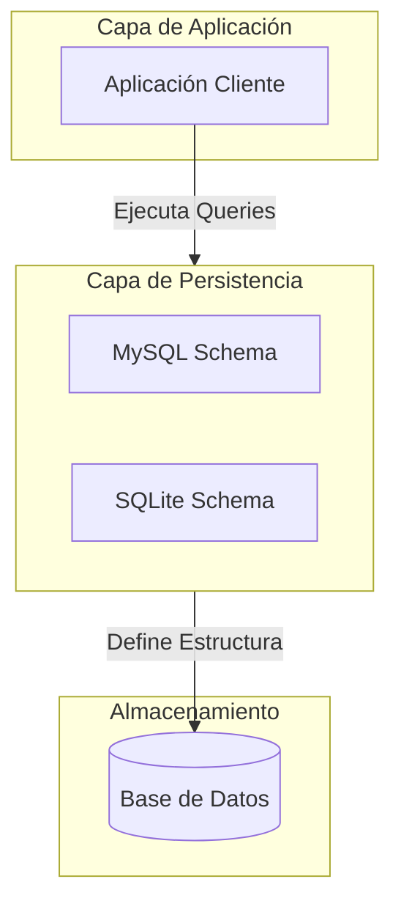

# Proyecto Final: Gestión de Bases de Datos
<p align="center">
  
  
  
  <br>
  <h3 align="center">Arquitectura de Datos Escalable y Modular</h3>
  <p align="center">Una solución robusta para el modelado, persistencia y gestión de esquemas relacionales.</p>
</p>

---

## 🎯 Propuesta de Valor
Este repositorio centraliza la lógica de modelado y persistencia de datos para el proyecto final. Su objetivo es proporcionar una base sólida, normalizada y agnóstica al motor de base de datos, permitiendo una transición fluida entre entornos de desarrollo (SQLite) y producción (MySQL).

## ✨ Características Principales
*   **Modelado Normalizado**: Esquemas diseñados bajo principios de integridad referencial y optimización de consultas.
*   **Multi-Motor**: Soporte nativo para `MySQL` y `SQLite` mediante scripts de migración dedicados.
*   **Arquitectura Modular**: Separación clara de responsabilidades en la capa de persistencia.
*   **Documentación de Esquemas**: Scripts SQL versionados para asegurar la consistencia en cualquier entorno.

## 🏗️ Arquitectura del Sistema


## 🛠️ Stack Tecnológico

| Categoría | Tecnología | Utilidad |
| :--- | :--- | :--- |
| **Base de Datos** | MySQL | Motor de persistencia en producción |
| **Base de Datos** | SQLite | Motor ligero para pruebas y desarrollo |
| **Lenguaje** | SQL | Definición de esquemas y manipulación |
| **Control de Versiones** | Git | Gestión del ciclo de vida del código |

## 📂 Estructura del Proyecto
```text
proyecto-final-bases-datos/
├── sql/
│   ├── schema_mysql.sql    # Definición de tablas para MySQL
│   └── schema_sqlite.sql   # Definición de tablas para SQLite
└── README.md               # Documentación principal
```

## 🚀 Guía de Instalación Rápida

### 1. Clonar el repositorio
```bash
git clone https://github.com/jfinfotest/proyecto-final-bases-datos.git
cd proyecto-final-bases-datos
```

### 2. Configuración de Entorno
Copia el archivo de ejemplo para configurar tus variables de conexión:
```bash
cp .env.example .env
# Edita el archivo .env con tus credenciales de base de datos
```

### 3. Inicialización de la Base de Datos
Dependiendo de tu entorno, ejecuta el script correspondiente:
*   **Para MySQL:**
    ```bash
    mysql -u [usuario] -p [nombre_db] < sql/schema_mysql.sql
    ```
*   **Para SQLite:**
    ```bash
    sqlite3 database.db < sql/schema_sqlite.sql
    ```

## 📜 Scripts Disponibles
Actualmente, el proyecto se gestiona mediante la ejecución directa de scripts SQL. Se recomienda el uso de herramientas como **DBeaver** o **MySQL Workbench** para la ejecución de los archivos contenidos en `/sql`.

## 🤝 Contribución y Licencia
Este proyecto es de código abierto. Si deseas contribuir, por favor abre un *Issue* o envía un *Pull Request*.

*   **Contribución**: Sigue las guías estándar de Git Flow.
*   **Licencia**: Este proyecto está bajo la licencia **MIT**. Consulta el archivo `LICENSE` para más detalles.

---
*Desarrollado con ❤️ por [jfinfotest](https://github.com/jfinfotest)*